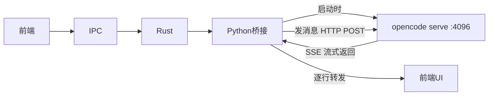
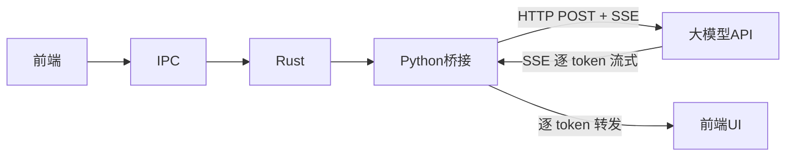

# Ripple Desktop — OpenCode 流式集成方案评估

## 一、现状

Ripple Desktop 是一个 AI 编程助手桌面端（Tauri + React），通过 Python 桥接调用 OpenCode CLI 执行 AI 任务。

当前 **功能已基本打通**，但存在一个核心问题：**不是真正的流式输出**。

---

## 二、已解决的问题

### 问题 1：点击项目多出一条对话 ✅ 已修复

| 项目 | 内容 |
|------|------|
| 现象 | 点击侧边栏项目，对话列表多出一条同名普通对话 |
| 根因 | 项目被当作"实体"而非"对话"，添加时没创建聊天记录，点击时又新建一条 |
| 修复 | 添加项目时立即创建一条 chat 对话，标题=项目名，关联 projectId；对话列表过滤掉有 projectId 的对话 |

### 问题 2：OpenCode 模型发送后 UI 无数据显示 ✅ 已修复

| 项目 | 内容 |
|------|------|
| 现象 | 选 OpenCode 模型发送消息，后端 CLI 执行成功，但 UI 没有任何显示 |
| 根因 1 | Rust 后端 `ws_event_loop` 和 `send_to_bridge` 共用一把锁，事件循环持锁等消息时，发送方拿不到锁 → 死锁 |
| 修复 1 | 改用 channel+select! 架构，事件循环独占 WebSocket 流，通过 mpsc channel 收发消息，彻底消除锁竞争 |
| 根因 2 | `execute_opencode_streaming` 中 `stderr=subprocess.PIPE` 未消费 → 管道缓冲区满 → 进程卡死 |
| 修复 2 | 改回 `stderr=subprocess.STDOUT` 合并输出 |
| 根因 3 | `_strip_ansi` 使用 `re.sub()` 但未 `import re` → 首行输出后崩溃 |
| 修复 3 | 补上 `import re` |

---

## 三、当前核心问题：`opencode run` 不是逐 token 流式

### 现象

```
用户发送 "你是什么大模型"
  → 0-3 秒: 输出 build 横幅 "> build · nemotron-3-super-free"
  → 3-25 秒: 完全静默（无任何输出）
  → 25-30 秒: 一次性输出完整 AI 回答
```

UI 体验：发送后转圈 20 多秒，然后内容突然全部出现，不是逐字流式效果。

### 根因

通过验证确认：**`opencode run` 命令本身就不支持逐 token 流式输出。**

| 测试方式 | 结果 |
|---------|------|
| 终端直接跑 `opencode run "hi"` | 先出 build 横幅，等十几秒，一次性输出回答 |
| 通过 pipe 跑（`\| findstr .`） | 同上 |
| `opencode --format json` | 格式不同，但同样非流式 |

而 `opencode` 默认进入的 **TUI 交互模式**（直接 `opencode` 回车）是真正流式的——逐 token 显示回复。但这是交互式终端 UI，不是 CLI 命令模式。

**结论**：`opencode run` 是一个为"一次性执行"设计的命令，不具备逐 token 流式能力。流式能力只在交互式 TUI 或 `opencode serve` 服务模式中提供。

---

## 四、可选解决方案

### 方案 A：保持现状（推荐短期）

**做法**：继续使用 `opencode run`，接受 20-30 秒静默后一次性输出。

**代价**：
- UI 体验差：用户发送后需等待 20+ 秒无反馈
- 技术复杂度低，当前代码已可用

**适用场景**：快速验证、内部使用、对实时性要求不高

### 方案 B：改用 `opencode serve` + SSE 流式（推荐中期）

**思路**：`opencode serve` 启动 headless HTTP 服务，支持 SSE（Server-Sent Events）实时推送 token。



**改动量**：
- 桥接启动时自动 `opencode serve --port 4096`（后台常驻进程）
- 发消息改为 HTTP 请求 + SSE 解析
- 管理 serve 进程生命周期（启动、健康检查、重启、关闭）
- 端口冲突处理、并发请求队列

**优势**：
- 获得真正逐 token 流式体验
- `opencode serve` 本身是无头模式，适合服务化

**风险**：
- `opencode serve` 的行为和稳定性需验证（没实际测试过）
- 需要处理 serve 进程的异常退出和自动重启

### 方案 C：绕过 opencode，直接调 AI API（推荐长期）

**思路**：去掉 opencode CLI 这个中间层，桥接直接通过 HTTP 调用大模型 API（如 OpenAI 兼容接口），获取真正的 SSE 流式回复。



**优势**：
- 彻底解决流式问题（API 原生支持 SSE）
- 减少一层依赖（不再依赖 opencode CLI）
- 更可控：响应速度、模型切换、错误处理

**代价**：
- 放弃 opencode 的 agent 能力（自动执行 shell 命令、读写文件等）
- 需要自己管理 API Key、模型路由

---

## 五、建议

| 时间线 | 方案 | 原因 |
|--------|------|------|
| 现在 | **方案 A**（保持现状） | 功能已通，可演示、可内部用 |
| 1-2 周 | **尝试方案 B**，验证 `opencode serve` 可行性 | 如果 serve 模式稳定且支持 SSE，是最小改动拿到真流式的路径 |
| 长期 | **方案 C**（直接调 API）或 **方案 B 稳定后定型** | 取决于产品定位：要 opencode 的 agent 能力，还是要纯粹的流式 AI 对话 |

---

*文档版本: v1.0 | 2026-05-14*
